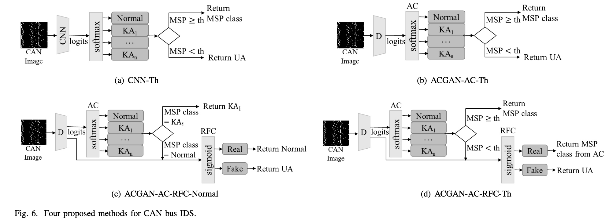
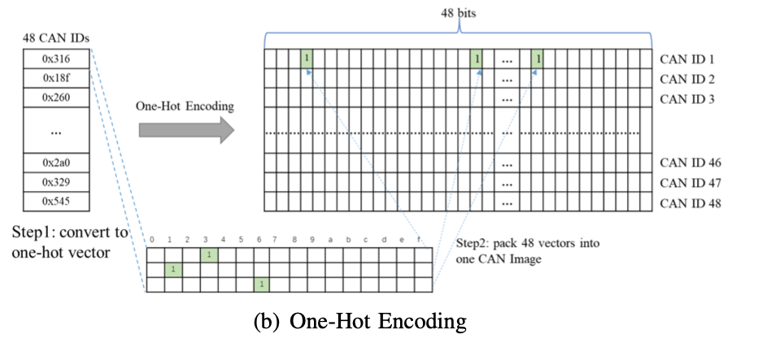
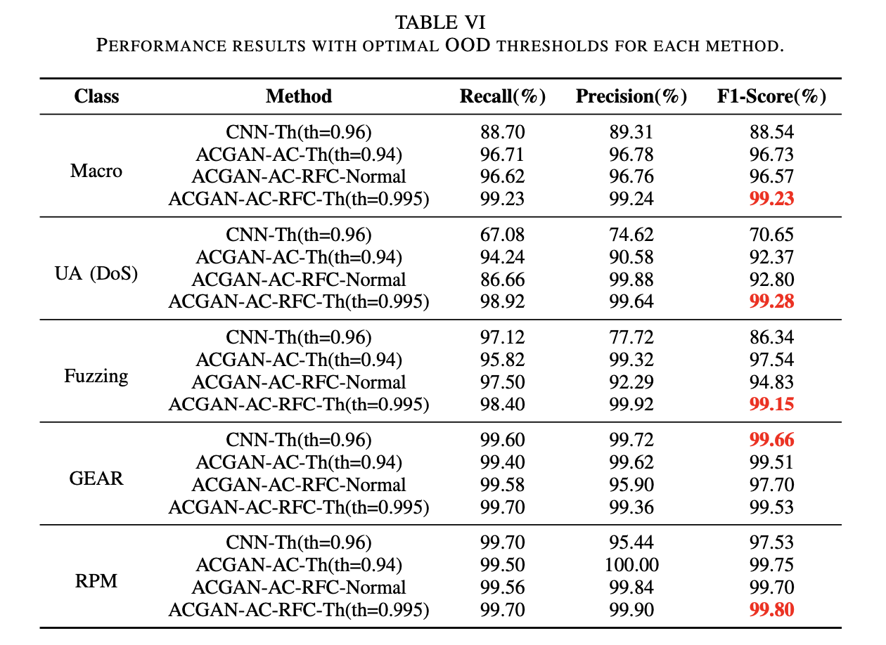

# CAN_GAN_Anomaly
"CAN Bus Intrusion Detection based on ACGAN and Out-of-DistributionDetection" Code 

## Abstract
Modern vehicles are prototypical Cyber-Physical Systems, where the
in-vehicle Electrical/Electronic (E/E) system interacts closely with its
physical surroundings. With the rapid advances in Connected and Automated
Vehicles, the issue of automotive cyber-physical security is gaining
increasing importance. The Controller Area Network (CAN) is a ubiquitous
bus protocol present in almost all vehicles. Due to its broadcast nature,
it is vulnerable to a range of attacks once the attacker gains access to
the bus through either the physical or cyber part of the attack surface. We
address the problem of Intrusion Detection on the CAN bus, and propose four
methods based on the combination of one or more classifiers trained with
Auxiliary Classifier Generative Adversarial Network (ACGAN), and the use of
Out-of-Distribution (OOD) Detection to detect unknown attacks. Our work is
the first and only technique that is able to detect both known and unknown
attacks, and also assign fine-grained labels to detected known attacks. Experimental
results demonstrate that the most effective method is a cascaded two-stage
classification architecture, with the multi-class Auxiliary Classifier in
the first stage, passing OOD samples to the binary Real/Fake Classifier in
the second state.

## Model structure


## Dataset
You can download the raw data from [CAN Datasets](https://ocslab.hksecurity.net/Datasets/CAN-intrusion-dataset)

Convert raw data to CAN Image can refer to the method in figure 

## Result


## Conda environment
```shell
    # create conda environment
    conda create -n ACGIDS python=3.7
    # delete conda environment
    conda remove -n ACGIDS --all
    # activate conda environment
    conda activate ACGIDS
    # install third-party libraries
    pip install --user --requirement requirements.txt
```

## Usage
```shell
    # Train Script
    bash experiments/run_can.sh
    
    # Test Script
    # NOTE: Need to be modified to your storage model parameter location
    # NOTE: The pkl folder provides the same model parameters as the experiments in the paper, if needed, you can use
    bash experiments/run_can_val.sh
```

## Visualdl
```shell
    # you can pip visualdl lib follow as:
    pip install visualdl -i https://mirror.baidu.com/pypi/simple
    
    # start visualdl service, load model saved log
    nohup visualdl --logdir log --port 8080 &
```

if you find our model/method/dataset useful, please cite our work:
```angular2html

```